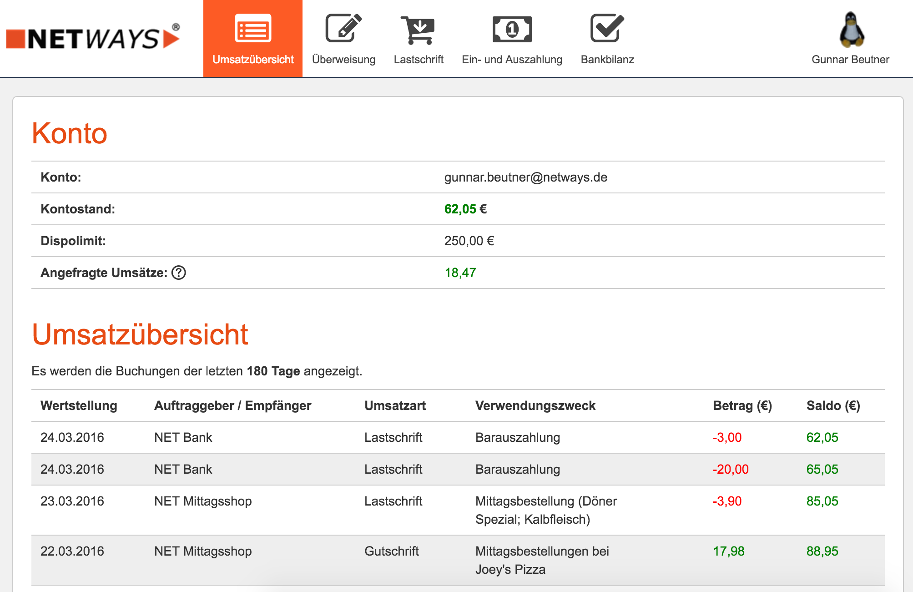

# Bank

A small self-service online banking app for lunch orders in the office.

## Features:

 * Account overview
 * Transfers with smsTAN
 * Direct debit
 * HBCI integration (lets users top up their accounts)
 * Deposits/pay-outs
 * Authorization hold
 * 2FA authentication (Yubikey only for now)

## Screenshots



## Requirements

 * PHP 5.6+
 * AqBanking

## Installation

1. Install the PHP GD extension:

```
apt-get install php5-gd
```

2. Install Composer in the project directory:

```
curl -sS https://getcomposer.org/installer | php
```

3. Install dependencies:

```
php composer.phar update
```

4. Create a new config file called 'config.php'. You can use 'config.example.php' as a template.

5. Set up mod_rewrite and mod_alias rules:

```
RewriteEngine on
RewriteRule ^/?$ /app/login [R,L]
RewriteRule /app/.* /app.php [L]

Alias /vendor /home/bank/bank-app/vendor
```

6. Restart Apache:

```
service apache2 restart
```
